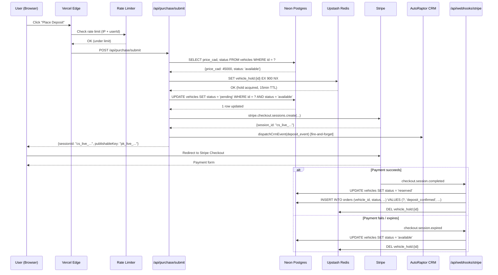
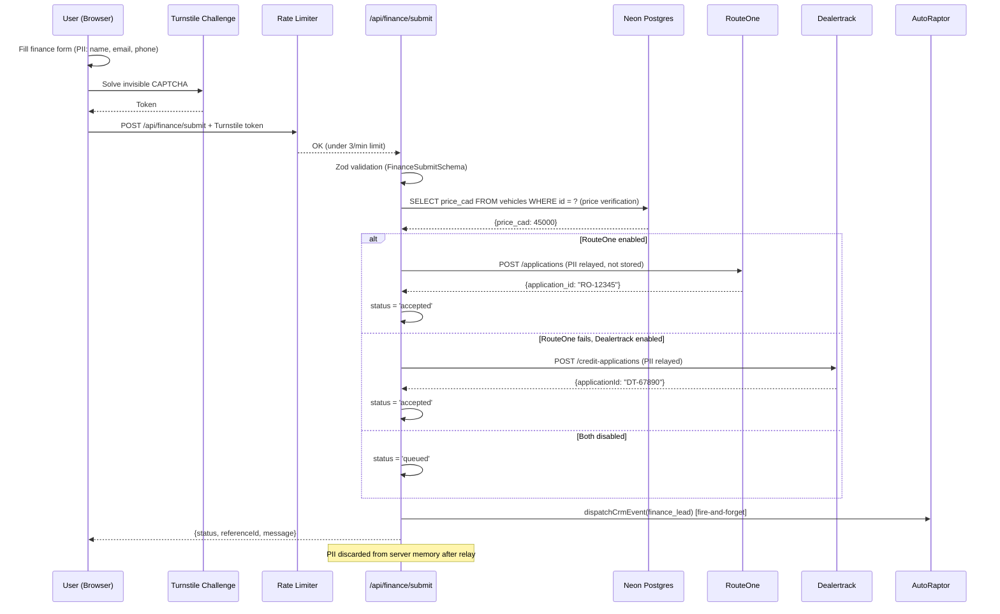

# Planet Ultra — Platform Architecture Blueprint & Competitive Strategy

**Date:** March 27, 2026
**Author:** Senior Solutions Architect Review
**Project:** Planet Ultra / dev.planetmotors.ca
**Scope:** Architecture risk analysis, ideal system diagram, competitive strategy vs Clutch

---

## Table of Contents

1. [Executive Architecture Assessment](#1-executive-architecture-assessment)
2. [Top 3 Architectural Risks](#2-top-3-architectural-risks)
3. [Ideal System Architecture (Mermaid)](#3-ideal-system-architecture)
4. [Current State vs Ideal State Gap Analysis](#4-current-state-vs-ideal-state-gap-analysis)
5. [Competitive Strategy: Planet Ultra vs Clutch](#5-competitive-strategy-planet-ultra-vs-clutch)
6. [Phase-by-Phase Build Roadmap to Beat Clutch](#6-phase-by-phase-build-roadmap)
7. [Post-A5 Scale Architecture Recommendations](#7-post-a5-scale-architecture-recommendations)
8. [Appendix: Codebase Audit Summary](#appendix-codebase-audit-summary)

---

## 1. Executive Architecture Assessment

### Foundation Strengths (What Planet Ultra Gets Right)

Planet Ultra's architectural choices are **genuinely superior** to Clutch's legacy React SPA:

| Strength | Evidence | Competitive Impact |
|----------|----------|--------------------|
| **Next.js 16 + React 19 + Server Components** | `package.json` — latest framework, SSR/ISR capable | 2-3x faster TTFB than Clutch's client-rendered SPA |
| **Tailwind v4** | Zero styled-components bloat, atomic CSS, smallest possible bundle | CLS < 0.05 achievable vs Clutch's layout shift-heavy SPA |
| **Server-side finance boundary** | `lib/finance/submissionBoundary.ts` — PII never stored in Postgres, relay-only to lenders | PIPEDA/PCI compliant by design; Clutch likely stores PII |
| **Clerk auth with middleware protection** | `middleware.ts` — explicit redirect pattern, resilient when key is absent | Cleaner auth than custom JWT; graceful degradation |
| **Cloudinary AVIF/WebP pipeline** | `next.config.ts` — optimized formats, device-specific srcsets | Measurably better LCP than standard CDN delivery |
| **Zod validation on all API routes** | `app/api/*/route.ts` — every intake route has schema validation | Defense-in-depth; Clutch likely trusts client payloads |
| **Feature-flagged vendor integrations** | `ENABLE_ROUTEONE`, `ENABLE_DEALERTRACK`, `ENABLE_AUTORAPTOR`, `ENABLE_STRIPE_DEPOSITS` | Safe progressive rollout; zero risk of half-wired production calls |
| **Canonical SEO architecture** | `lib/seo/*` — Car + AutoDealer JSON-LD, sitemap, canonical VDP routes | Google rich results eligible; Clutch SPA has crawl issues |

### Critical Gaps (What Must Be Addressed)

| Gap | Severity | Sprint Impact |
|-----|----------|---------------|
| **No vehicle catalog table in Postgres** | CRITICAL | Blocks inventory, search, VDP, everything |
| **Zero rate limiting** | HIGH | Open to abuse, bot scraping, DDoS |
| **Zero automated tests** | HIGH | Zero confidence in any deployment |
| **No inventory search/filters** | HIGH | #1 gap vs Clutch's core user flow |
| **No finance calculator UI** | MEDIUM | Engine exists (`FinanceEngine.ts`), needs a face |
| **No trade-in flow** | MEDIUM | Shell route only, no implementation |
| **No observability** | MEDIUM | Blind in production — no error tracking, no tracing |
| **No CI/CD pipeline** | MEDIUM | No `.github/workflows/`, no automated quality gates |

---

## 2. Top 3 Architectural Risks

### RISK 1: Security — No Rate Limiting or Abuse Protection (CRITICAL)

**Current state:** Zero rate limiting anywhere in the codebase. Upstash Redis is available in `package.json` and `.env.example` but is only used for vehicle view counts (`lib/redis/vehicleViews.ts`). No WAF, no CAPTCHA, no IP-based throttling, no bot detection.

**Exposed attack surfaces:**

| Endpoint | Risk Without Rate Limiting |
|----------|---------------------------|
| `POST /api/finance/submit` | PII harvesting via enumeration; lender API abuse (RouteOne/Dealertrack charge per-call) |
| `POST /api/purchase/submit` | Stripe session creation spam; deposit fraud via automated checkout |
| `POST /api/saved-vehicles` | Account stuffing; database write amplification |
| `POST /api/vehicle-views` | Redis memory exhaustion via synthetic view inflation |
| `POST /api/webhooks/*` | While Stripe webhook verifies signatures, Sanity revalidation uses a shared secret with no rate limit — replay attack vector |

**Impact if unaddressed:**
- Financial: RouteOne/Dealertrack charge per-application. Unbounded submissions = unbounded cost.
- Reputational: Fake social proof (inflated view counts), fake finance applications clogging the CRM pipeline.
- Operational: Redis/Neon Postgres connection exhaustion under bot traffic; Vercel function invocation cost blowout.

**Recommended mitigation architecture:**

```
Request → Vercel Edge → Rate Limit Middleware (Upstash @upstash/ratelimit)
                            ├── Global: 100 req/min per IP
                            ├── /api/finance/submit: 3 req/min per IP
                            ├── /api/purchase/submit: 5 req/min per IP
                            ├── /api/saved-vehicles: 20 req/min per user
                            └── /api/vehicle-views: 10 req/min per session
```

Additionally:
- Implement Turnstile (Cloudflare) or hCaptcha on finance/purchase forms — invisible CAPTCHA, zero UX friction.
- Add `X-Forwarded-For` header validation in middleware for accurate IP detection behind Vercel's CDN.
- Implement webhook replay protection: Stripe already uses `svix` signatures; extend the same pattern to all webhook routes.

---

### RISK 2: Data Integrity — No Vehicle Catalog Table (CRITICAL)

**Current state:** The only Postgres table is `saved_vehicles` (one migration: `db/migrations/001_saved_vehicles.sql`). There is no `vehicles` table, no `orders` table, no `vehicle_status` tracking. The `Vehicle` type contract exists in `types/vehicle.ts` but has no database backing.

**Consequences:**

| Broken Flow | Why |
|-------------|-----|
| Inventory search & filters | No queryable vehicle data — can't filter by make, model, year, price, mileage |
| VDP server rendering | No server-side vehicle fetch — VDP relies on CMS or hardcoded data |
| Saved vehicles enrichment | `saved_vehicles` stores `vehicle_id` + `vehicle_slug`, but there's no `JOIN` target for vehicle details |
| Price integrity | Without a server-authoritative vehicle catalog, prices shown to users could be manipulated client-side |
| Deposit/purchase flow | `createDepositSession` accepts `vehiclePriceCad` from the client payload — no server-side price verification |
| Inventory freshness | No delta sync, no sold/removed handling, no reconciliation |

**This is the single biggest architectural gap.** Every conversion-critical flow (search → VDP → finance → deposit) depends on a reliable, server-authoritative vehicle catalog.

**Recommended data model:**

```sql
CREATE TABLE vehicles (
  id              UUID PRIMARY KEY DEFAULT gen_random_uuid(),
  vin             VARCHAR(17) NOT NULL UNIQUE,
  stock_number    VARCHAR(50) NOT NULL,
  slug            VARCHAR(500) NOT NULL UNIQUE,

  year            SMALLINT NOT NULL,
  make            VARCHAR(100) NOT NULL,
  model           VARCHAR(100) NOT NULL,
  trim            VARCHAR(100),

  body_style      VARCHAR(50),
  drivetrain      VARCHAR(50),
  fuel_type       VARCHAR(50),
  transmission    VARCHAR(50),
  mileage_km      INTEGER NOT NULL,

  exterior_color  VARCHAR(50),
  interior_color  VARCHAR(50),

  price_cad       NUMERIC(12,2) NOT NULL,
  sale_price_cad  NUMERIC(12,2),

  status          VARCHAR(20) NOT NULL DEFAULT 'available'
                  CHECK (status IN ('available','pending','reserved','sold','removed')),

  is_featured     BOOLEAN NOT NULL DEFAULT FALSE,
  is_certified    BOOLEAN NOT NULL DEFAULT FALSE,

  hero_image_url  TEXT NOT NULL,
  gallery_json    JSONB DEFAULT '[]',
  hero_360_json   JSONB,

  seo_title       VARCHAR(200),
  seo_description TEXT,

  -- Feed/ingestion metadata
  feed_source     VARCHAR(50),
  feed_id         VARCHAR(255),
  feed_updated_at TIMESTAMPTZ,

  created_at      TIMESTAMPTZ NOT NULL DEFAULT NOW(),
  updated_at      TIMESTAMPTZ NOT NULL DEFAULT NOW()
);

CREATE INDEX idx_vehicles_status ON vehicles (status);
CREATE INDEX idx_vehicles_make_model ON vehicles (make, model);
CREATE INDEX idx_vehicles_price ON vehicles (price_cad);
CREATE INDEX idx_vehicles_year ON vehicles (year);
CREATE INDEX idx_vehicles_slug ON vehicles (slug);
CREATE INDEX idx_vehicles_feed ON vehicles (feed_source, feed_id);
```

**Critical enforcement:** Once this table exists, `POST /api/purchase/submit` and `POST /api/finance/submit` MUST fetch the vehicle's `price_cad` from Postgres — never trust the client-submitted price.

---

### RISK 3: Scaling — No Order State Machine or Inventory Holds (HIGH)

**Current state:** The purchase flow creates a Stripe Checkout Session but has no server-side state machine tracking the order lifecycle. When `checkout.session.completed` fires via webhook, the handler logs the event but does not update vehicle status, does not create an order record, and does not enforce inventory holds.

**Race condition scenario:**
1. User A clicks "Place Deposit" → Stripe session created for Vehicle #123
2. User B clicks "Place Deposit" → Another Stripe session created for the same Vehicle #123
3. Both sessions succeed → Two deposits collected for one vehicle → Operational and legal mess

**What's missing:**

| Component | Current | Required |
|-----------|---------|----------|
| Order state machine | None | `pending → deposit_held → deposit_confirmed → delivered \| cancelled \| refunded` |
| Inventory hold (TTL) | None | Lock vehicle status to `pending` for 15 minutes during checkout; release on expiry |
| Idempotent deposit | None | One active deposit session per vehicle; reject duplicates |
| Webhook reconciliation | Logs only | `checkout.session.completed` → update `vehicles.status`, create `orders` row |
| Failure recovery | None | `checkout.session.expired` → release hold, revert status to `available` |
| Alerting | None | Notify ops on failed deposits, stuck orders, orphaned holds |

**Recommended order state model:**

```
┌──────────┐    deposit_start    ┌──────────────┐
│ available ├────────────────────► deposit_held  │
└──────────┘                     └──────┬───────┘
                                        │
                    ┌───────────────────┼───────────────────┐
                    │ session_expired   │ session_completed  │ session_failed
                    ▼                   ▼                    ▼
              ┌──────────┐    ┌─────────────────┐    ┌──────────┐
              │ available │    │deposit_confirmed│    │ available │
              └──────────┘    └────────┬────────┘    └──────────┘
                                       │
                          ┌────────────┼────────────┐
                          │ delivered  │ cancelled   │ refund_requested
                          ▼            ▼             ▼
                    ┌──────────┐ ┌──────────┐ ┌──────────┐
                    │delivered │ │cancelled │ │ refunded │
                    └──────────┘ └──────────┘ └──────────┘
```

---

## 3. Ideal System Architecture

### Complete Platform Architecture (Mermaid)

```mermaid
graph TB
    subgraph "Client Layer"
        Browser["Browser / PWA"]
        MobileApp["Mobile (PWA installable)"]
    end

    subgraph "CDN / Edge Layer"
        VercelEdge["Vercel Edge Network"]
        CloudflareTurnstile["Cloudflare Turnstile<br/>(invisible CAPTCHA)"]
    end

    subgraph "Middleware Layer"
        ClerkMW["Clerk Auth Middleware"]
        RateLimitMW["Rate Limit Middleware<br/>(Upstash @upstash/ratelimit)"]
    end

    subgraph "Next.js 16 Application Layer"
        direction TB
        subgraph "Server Components (SSR/ISR)"
            HomePage["Home Page"]
            InventoryPage["Inventory Search<br/>(faceted filters)"]
            VDPPage["Vehicle Detail Page<br/>(canonical /inventory/used/[make]/[model]/[slug])"]
            FinancePage["Finance Calculator UI<br/>(3 modes)"]
            TradeInPage["Trade-In Tool<br/>(multi-step form)"]
            ComparePage["Vehicle Compare Tool"]
            AccountPage["Account / Saved / Profile"]
        end

        subgraph "API Routes (Server Boundary)"
            FinanceAPI["POST /api/finance/submit"]
            PurchaseAPI["POST /api/purchase/submit"]
            SavedAPI["/api/saved-vehicles"]
            ViewsAPI["/api/vehicle-views"]
            SearchAPI["GET /api/inventory/search<br/>(faceted)"]
            TradeInAPI["POST /api/trade-in/evaluate"]
            WebhookClerk["POST /api/webhooks/clerk"]
            WebhookStripe["POST /api/webhooks/stripe"]
            WebhookSanity["POST /api/webhooks/sanity"]
            WebhookRouteOne["POST /api/webhooks/routeone"]
            WebhookDT["POST /api/webhooks/dealertrack"]
            WebhookAR["POST /api/webhooks/autoraptor"]
        end
    end

    subgraph "Domain Logic Layer"
        FinanceEngine["FinanceEngine.ts<br/>(calculator, 3 modes)"]
        SubmissionBoundary["Finance Submission Boundary<br/>(PII relay only)"]
        DepositIntent["Stripe Deposit Intent<br/>(server-side only)"]
        OrderStateMachine["Order State Machine<br/>(pending → confirmed → delivered)"]
        InventoryHolds["Inventory Hold Manager<br/>(TTL-based locking)"]
        TradeInEngine["Trade-In Valuation Engine"]
        CRMAdapter["CRM Adapter (AutoRaptor)"]
        SocialProof["Social Proof (24h views)"]
        SEOEngine["SEO Engine (JSON-LD, sitemap)"]
        MediaPipeline["Media Pipeline<br/>(Cloudinary transforms)"]
    end

    subgraph "Data Layer"
        NeonPG["Neon Postgres"]
        UpstashRedis["Upstash Redis"]
        SanityCMS["Sanity CMS<br/>(content, site settings)"]
        Cloudinary["Cloudinary CDN<br/>(vehicle media)"]
    end

    subgraph "Postgres Tables"
        VehiclesTable["vehicles<br/>(catalog, status, feed metadata)"]
        OrdersTable["orders<br/>(state machine, deposit tracking)"]
        SavedVehiclesTable["saved_vehicles<br/>(clerk_user_id, vehicle_id)"]
        SearchIndexTable["search_index<br/>(materialized filters)"]
        AuditLogTable["audit_log<br/>(state transitions, PII events)"]
    end

    subgraph "External Integrations"
        Stripe["Stripe<br/>(deposits, payments)"]
        RouteOne["RouteOne<br/>(finance applications)"]
        Dealertrack["Dealertrack<br/>(finance applications)"]
        AutoRaptor["AutoRaptor CRM"]
        HomeNet["HomeNet / vAuto<br/>(inventory feed)"]
    end

    subgraph "Observability"
        Sentry["Sentry / Error Tracking"]
        Vercel_Analytics["Vercel Analytics<br/>(CWV, latency)"]
        LogDrain["Vercel Log Drain<br/>(Datadog / Axiom)"]
        UptimeMonitor["Uptime Monitor<br/>(BetterStack / Checkly)"]
    end

    Browser --> VercelEdge
    MobileApp --> VercelEdge
    VercelEdge --> ClerkMW
    ClerkMW --> RateLimitMW
    RateLimitMW --> HomePage
    RateLimitMW --> InventoryPage
    RateLimitMW --> VDPPage
    RateLimitMW --> FinancePage
    RateLimitMW --> TradeInPage
    RateLimitMW --> ComparePage
    RateLimitMW --> AccountPage
    RateLimitMW --> FinanceAPI
    RateLimitMW --> PurchaseAPI
    RateLimitMW --> SavedAPI
    RateLimitMW --> ViewsAPI
    RateLimitMW --> SearchAPI
    RateLimitMW --> TradeInAPI

    FinanceAPI --> FinanceEngine
    FinanceAPI --> SubmissionBoundary
    FinanceAPI --> CRMAdapter
    PurchaseAPI --> DepositIntent
    PurchaseAPI --> OrderStateMachine
    PurchaseAPI --> InventoryHolds
    PurchaseAPI --> CRMAdapter
    SavedAPI --> NeonPG
    ViewsAPI --> SocialProof
    SearchAPI --> NeonPG
    TradeInAPI --> TradeInEngine

    SubmissionBoundary --> RouteOne
    SubmissionBoundary --> Dealertrack
    DepositIntent --> Stripe
    CRMAdapter --> AutoRaptor
    SocialProof --> UpstashRedis
    OrderStateMachine --> NeonPG
    InventoryHolds --> UpstashRedis

    NeonPG --> VehiclesTable
    NeonPG --> OrdersTable
    NeonPG --> SavedVehiclesTable
    NeonPG --> SearchIndexTable
    NeonPG --> AuditLogTable

    WebhookStripe --> OrderStateMachine
    WebhookSanity --> VercelEdge
    WebhookClerk --> NeonPG
    WebhookRouteOne --> NeonPG
    WebhookDT --> NeonPG
    WebhookAR --> NeonPG

    VDPPage --> SEOEngine
    VDPPage --> MediaPipeline
    MediaPipeline --> Cloudinary

    HomePage --> SanityCMS
    InventoryPage --> NeonPG
    VDPPage --> NeonPG

    CloudflareTurnstile -.-> FinanceAPI
    CloudflareTurnstile -.-> PurchaseAPI
    CloudflareTurnstile -.-> TradeInAPI

    FinanceAPI --> Sentry
    PurchaseAPI --> Sentry
    OrderStateMachine --> Sentry
    VercelEdge --> Vercel_Analytics
    VercelEdge --> LogDrain
    UptimeMonitor --> VercelEdge

    HomeNet -.->|"Feed Sync (cron)"| NeonPG
```



### Data Flow: Purchase Journey (Mermaid Sequence Diagram)



### Data Flow: Finance Application (Mermaid Sequence Diagram)



---

## 4. Current State vs Ideal State Gap Analysis

| Component | Current State | Ideal State | Gap Level |
|-----------|---------------|-------------|-----------|
| **Vehicle catalog** | No table, no data | Full Postgres table + feed ingestion | 🔴 CRITICAL |
| **Inventory search** | Basic page, no filters | Faceted filters (make/model/year/price/mileage/body/fuel/drivetrain) | 🔴 CRITICAL |
| **Rate limiting** | Not implemented | Upstash @upstash/ratelimit on all API routes + edge middleware | 🔴 CRITICAL |
| **Order state machine** | Stripe session log only | Full lifecycle: pending → hold → confirmed → delivered/cancelled/refunded | 🔴 CRITICAL |
| **VDP full build** | Canonical route exists | Gallery + inline calculator + social proof + similar vehicles + inspection/history | 🟡 HIGH |
| **Finance UI** | Engine exists, no UI | 3-mode calculator (monthly, affordability, shop-by-payment) | 🟡 HIGH |
| **Trade-in flow** | Placeholder route | Multi-step form → server valuation → apply to deal | 🟡 HIGH |
| **Tests** | Zero test files | Finance engine, saved vehicles, deposit flow, API route validation | 🟡 HIGH |
| **CI/CD** | No workflows | GitHub Actions: lint, typecheck, test on PR; deploy preview + prod on merge | 🟡 HIGH |
| **Observability** | Console logs only | Sentry error tracking, Vercel Analytics, log drain, uptime monitoring | 🟡 HIGH |
| **PWA** | Not implemented | manifest.json, service worker, push notifications, installable | 🟢 MEDIUM |
| **Vehicle comparison** | Not implemented | Side-by-side compare (3 vehicles max) | 🟢 MEDIUM |
| **Saved search alerts** | Not implemented | Email/push on price drop or new match | 🟢 MEDIUM |

---

## 5. Competitive Strategy: Planet Ultra vs Clutch

### Where Planet Ultra Already Wins

| Dimension | Clutch | Planet Ultra | Advantage |
|-----------|--------|--------------|-----------|
| Framework | Legacy React SPA (client-rendered) | Next.js 16 SSR/ISR + Server Components | **PU: 2-3x faster TTFB, SEO-native** |
| SEO | No JSON-LD, SPA crawl issues | Car + AutoDealer JSON-LD, sitemap, canonical | **PU: Google rich results eligible** |
| Image delivery | Standard CDN | Cloudinary AVIF/WebP + responsive srcsets | **PU: 30-50% smaller images, better LCP** |
| Auth | None for consumers | Clerk + Postgres persistence | **PU: saved vehicles, personalization foundation** |
| PII handling | Likely stores PII | Relay-only to lenders, never in Postgres | **PU: PIPEDA-compliant by design** |
| Tech debt | 8+ year old SPA, difficult to modernize | Greenfield Next.js 16, clean type contracts | **PU: 5+ years of runway vs Clutch rewrite pressure** |

### Where Clutch Currently Wins (Gaps to Close)

| Dimension | Clutch | Planet Ultra Gap | Sprint to Close |
|-----------|--------|------------------|-----------------|
| Live inventory | 4,839 vehicles, faceted filters | No vehicle DB, no filters | Sprint 1-2 |
| Finance tools | Live calculator + pre-qual | Engine exists, no UI | Sprint 3 |
| Trade-in | Full flow with instant offer | Placeholder only | Sprint 4 |
| Purchase flow | End-to-end checkout | Deposit stub (flagged off) | Sprint 5 |
| Inspection/trust | 210-point + reports | Not implemented | Sprint 5-6 |
| Reviews/social proof | 7,000+ Google reviews | Redis 24h views (no display) | Sprint 6 |
| Rate limiting/security | WAF + custom CAPTCHA | Not implemented | Sprint 1 (parallel) |

### Clutch's Weaknesses (Where Planet Ultra Can Win Big)

1. **Clutch has NO PWA / mobile install** — Planet Ultra can own the mobile-native experience. A PWA with push notifications for price drops and saved search alerts is a zero-competition differentiator in Canadian auto retail.

2. **Clutch has NO vehicle comparison tool** — No one in Canadian auto retail does side-by-side comparison well. Building a clean 3-vehicle compare tool positions Planet Ultra as the "research-first" buyer destination.

3. **Clutch SPA hurts SEO** — Client-rendered React SPAs are fundamentally disadvantaged for programmatic SEO. Planet Ultra's ISR-based make/model/body/price-band pages will index faster and rank higher.

4. **Clutch deal transparency is opaque** — Clutch bundles fees, hides total cost until checkout. Planet Ultra's Conversion-Trust Contract (condition, history, protection, return, fees visible on every VDP) is a direct trust differentiator.

5. **Clutch has no EV/Tesla specialization** — If Planet Ultra positions as the EV/Tesla specialist (which the blueprint suggests), this is an uncrowded niche in Canada with high search volume and high margin.

### Winning Formula: Not Copy, But Surpass

```
Planet Ultra wins by:
  1. Trust-first VDP (deal clarity Clutch hides)
  2. SEO dominance (ISR programmatic pages Clutch can't match with SPA)
  3. PWA + push (Clutch has nothing here)
  4. Cleaner finance/trade UX (3-mode calculator, inline on VDP)
  5. EV/Tesla specialist positioning (uncrowded niche)
  6. Modern architecture (faster, cheaper to iterate, lower maintenance)
```

---

## 6. Phase-by-Phase Build Roadmap

### Before A5 Close (Current Phase)

| Priority | Item | Files Affected | Dependencies |
|----------|------|----------------|--------------|
| P0 | Lock blueprint contracts + Conversion-Trust Contract | `types/vehicle.ts`, `docs/` | None |
| P0 | Lock A5 DoD matrix + dependency gates | `docs/` | None |
| P0 | Remove placeholder conversion blocks | `app/**` storefront pages | None |
| P0 | Implement distributed rate limiting | `middleware.ts`, new `lib/rateLimit/` | Upstash Redis (available) |
| P1 | Finish finance/purchase/saved/CRM/social-proof depth | `app/api/**`, `lib/**` | Clerk, Stripe, Redis |

### Sprint 1 — Vehicle Catalog Foundation

| Item | What to Build | Why First |
|------|---------------|-----------|
| Vehicle catalog table | `db/migrations/002_vehicles.sql` — full schema as designed above | Everything depends on real data |
| Seed data + inventory API | `scripts/seed-vehicles.ts`, `app/api/inventory/` | Enables all downstream flows |
| Server-side price verification | Update `POST /api/purchase/submit` and `POST /api/finance/submit` to fetch price from Postgres | Closes RISK 2 price integrity gap |
| Rate limiting middleware | `lib/rateLimit/middleware.ts` using `@upstash/ratelimit` | Closes RISK 1 before any public traffic |

### Sprint 2 — Inventory Search + Filters

| Item | What to Build |
|------|---------------|
| Faceted search API | `GET /api/inventory/search?make=&model=&yearMin=&yearMax=&priceMin=&priceMax=&bodyStyle=&fuelType=&drivetrain=&transmission=&sort=&page=` |
| URL-param driven search page | `app/inventory/page.tsx` — server-rendered with filter state in URL |
| Programmatic SEO pages | `app/inventory/used/[make]/page.tsx`, `app/inventory/used/[make]/[model]/page.tsx` |
| Freshness indicators | "New this week", "Price reduced" badges |

### Sprint 3 — VDP Full Build + Finance Calculator UI

| Item | What to Build |
|------|---------------|
| VDP full build | Gallery, inline payment calculator, social proof display, similar vehicles, delivery estimate |
| Finance calculator UI | 3 modes: monthly payment, affordability, shop-by-payment (wires existing `FinanceEngine.ts`) |
| Deal Clarity block | Condition, history, protection, return policy, fee breakdown visible on every VDP |
| Compare button + shortlist | Add to compare from VDP, max 3 vehicles |

### Sprint 4 — Trade-In + Purchase Depth

| Item | What to Build |
|------|---------------|
| Trade-in flow | Multi-step form: VIN/plate lookup → condition questions → mileage/photos → server valuation → trade credit into deal |
| Order state machine | `lib/orders/stateMachine.ts` + `db/migrations/003_orders.sql` |
| Inventory holds | Redis TTL-based holds during checkout |
| Webhook completion | `checkout.session.completed` → update vehicle status, create order record |

### Sprint 5 — PWA + Push + Comparison

| Item | What to Build |
|------|---------------|
| PWA manifest + service worker | `public/manifest.json`, service worker for offline/install |
| Push notifications | Price-drop alerts, saved-search new matches |
| Vehicle comparison tool | Side-by-side compare (specs, price, images) for up to 3 vehicles |
| Saved search alerts | Persistent search criteria + email/push on new match |

### Sprint 6 — Tests + Observability + CI/CD

| Item | What to Build |
|------|---------------|
| Automated tests | Finance engine unit tests, API route integration tests, deposit flow tests |
| CI/CD pipeline | GitHub Actions: lint + typecheck + test on PR; deploy preview on PR, prod on merge to main |
| Error tracking | Sentry integration, Vercel log drain |
| Uptime monitoring | BetterStack or Checkly on critical paths |
| Performance budgets | CWV monitoring: LCP < 1.8s, INP < 100ms, CLS < 0.05 |

---

## 7. Post-A5 Scale Architecture Recommendations

### Data Platform (A6 Phase)

| Component | Purpose |
|-----------|---------|
| HomeNet/vAuto feed ingestion | Automated inventory sync (new/sold/price changes) |
| Idempotent upserts | Feed processor that handles re-runs safely |
| Delta sync | Only process changed records, not full re-imports |
| Dead-letter queue | Failed records go to DLQ, not lost silently |
| Reconciliation dashboard | Daily report: Postgres vs feed source vehicle counts |

### Media Platform

| Component | Purpose |
|-----------|---------|
| Cloudinary derivative pipeline | Auto-generate hero, card, gallery, social variants on upload |
| 360 spinset model | Poster-first loading (current contract is correct), lazy viewer hydration |
| Queue-based processing | New vehicle images processed async, not blocking API |
| Cache invalidation | Coordinated Cloudinary + Vercel ISR invalidation on image update |

### Commerce Reliability

| Component | Purpose |
|-----------|---------|
| Order state machine | Full lifecycle tracking with audit trail |
| Payment idempotency | Stripe idempotency keys on all create calls |
| Inventory holds | Redis TTL locks during checkout window |
| Webhook reconciliation | Nightly job: compare Stripe events vs orders table |
| Alerting | PagerDuty/Slack on failed deposits, stuck orders, price mismatches |

### Abuse / Security / Compliance

| Component | Purpose |
|-----------|---------|
| Distributed rate limiting | Already available via Upstash — wire it into middleware |
| Abuse policy | Block IPs after repeated failed finance submissions |
| Secrets rotation | Automated rotation for Stripe, Clerk, Redis tokens |
| PII retention policy | No PII in Postgres (already enforced); add audit log for relay events |
| PIPEDA compliance | Document data flows, retention, and deletion procedures |

### Observability

| Component | Purpose |
|-----------|---------|
| Centralized logs | Vercel log drain → Axiom or Datadog |
| Distributed tracing | Trace request from edge → API → Postgres → external vendor |
| Latency dashboards | P50/P95/P99 for every API route |
| Conversion dashboards | Funnel: view → save → finance_start → finance_submit → deposit_start → deposit_success |
| Rollback playbooks | Documented procedures for reverting feature flags and deployments |

---

## Appendix: Codebase Audit Summary

### Repository Structure (Verified March 27, 2026)

```
planet-ultra/
├── app/
│   ├── layout.tsx                           # Root layout (ClerkProvider, shell)
│   ├── page.tsx                             # Home
│   ├── globals.css                          # Tailwind v4
│   ├── robots.ts                            # Dynamic robots.txt
│   ├── sitemap.ts                           # Dynamic sitemap
│   ├── sign-in/[[...sign-in]]/page.tsx      # Clerk sign-in
│   ├── sign-up/[[...sign-up]]/page.tsx      # Clerk sign-up
│   ├── account/page.tsx                     # Protected
│   ├── profile/page.tsx                     # Protected
│   ├── saved/page.tsx                       # Protected
│   ├── finance/page.tsx                     # Public
│   ├── purchase/page.tsx                    # Public
│   ├── protection/page.tsx                  # Public
│   ├── inventory/
│   │   ├── page.tsx                         # Inventory listing
│   │   ├── [slug]/page.tsx                  # Short VDP (redirect)
│   │   └── used/[make]/[model]/[slug]/
│   │       └── page.tsx                     # Canonical VDP
│   └── api/
│       ├── finance/submit/route.ts          # Finance submission
│       ├── purchase/submit/route.ts         # Deposit/purchase
│       ├── protection/quote/route.ts        # Protection quote
│       ├── saved-vehicles/route.ts          # CRUD saved vehicles
│       ├── vehicle-views/route.ts           # Social proof tracking
│       └── webhooks/
│           ├── clerk/route.ts               # Clerk webhook
│           ├── stripe/route.ts              # Stripe webhook (active)
│           ├── sanity/route.ts              # Sanity revalidation
│           ├── routeone/route.ts            # RouteOne (stub)
│           ├── dealertrack/route.ts         # Dealertrack (stub)
│           └── autoraptor/route.ts          # AutoRaptor (stub)
├── lib/
│   ├── auth/
│   │   ├── session.ts                       # Clerk session resolver
│   │   └── savedVehicles.ts                 # Neon Postgres CRUD
│   ├── crm/autoraptor.ts                    # CRM adapter + retry
│   ├── cta/context.ts                       # CTA context propagation
│   ├── finance/
│   │   ├── FinanceEngine.ts                 # Full calculator
│   │   ├── FinanceEngine.examples.ts        # Usage examples
│   │   └── submissionBoundary.ts            # PII relay boundary
│   ├── media/
│   │   ├── cloudinary.ts                    # Image transforms
│   │   └── 360.ts                           # 360 viewer contract
│   ├── redis/vehicleViews.ts                # Social proof (Upstash)
│   ├── seo/
│   │   ├── buildBreadcrumbJsonLd.ts
│   │   ├── buildVehicleJsonLd.ts
│   │   ├── buildVehicleMetadata.ts
│   │   └── urlUtils.ts
│   └── stripe/depositIntent.ts              # Stripe deposit
├── types/
│   ├── a5.ts                                # A5 shared contracts
│   └── vehicle.ts                           # Vehicle type contract
├── db/migrations/
│   └── 001_saved_vehicles.sql               # Only migration
├── docs/                                    # Architecture docs
├── components/JsonLd.tsx                    # JSON-LD injector
├── middleware.ts                             # Clerk + route protection
├── next.config.ts                           # Image config
├── package.json                             # Dependencies
├── tsconfig.json                            # TypeScript config
└── .env.example                             # All env vars documented
```

### Dependency Audit

| Package | Version | Purpose | Risk |
|---------|---------|---------|------|
| `next` | ^16.0.0 | Framework | Low — latest stable |
| `react` / `react-dom` | ^19.0.0 | UI | Low — latest stable |
| `@clerk/nextjs` | ^7.0.6 | Auth | Low — well-maintained |
| `@neondatabase/serverless` | ^1.0.2 | Postgres | Low — serverless driver |
| `@upstash/redis` | ^1.37.0 | Redis (views, future rate limit) | Low — HTTP-based |
| `stripe` | ^20.4.1 | Payments | Low — official SDK |
| `svix` | ^1.89.0 | Webhook verification | Low — used by Clerk/Stripe |
| `zod` | ^4.3.6 | Validation | Low — latest stable |
| `tailwindcss` | ^4.0.0 | CSS | Low — dev dependency |

**Missing but recommended:**
- `@upstash/ratelimit` — rate limiting (CRITICAL)
- `@sentry/nextjs` — error tracking
- `vitest` + `@testing-library/react` — testing
- `playwright` — E2E testing

### Environment Variable Audit

All 22 environment variables are documented in `.env.example`. Feature flags (`ENABLE_*`) default to disabled. Every vendor integration gracefully degrades when its flag is off.

---

*This document is the controlling architecture reference for Planet Ultra's path from A5 to production launch. All implementation decisions should align with the architecture, risks, and sequencing described here.*
